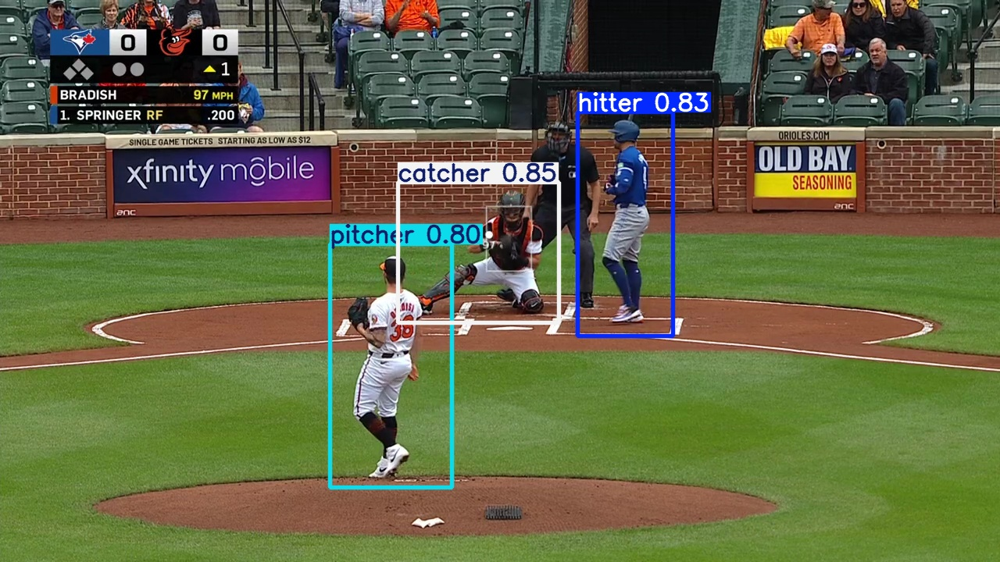

# BaseballCV


 **A collection of tools and models designed to aid in the use of Computer Vision in baseball.**

## Goals

Our goal is to provide access to high-quality datasets and computer vision models for baseball. By sharing our annotated data and model weights, we hope to foster innovation in sports analytics and make it easier for developers to create tools that analyze baseball games.

## Available Assets

### 1. Datasets
We provide open-source datasets containing images and corresponding annotations from baseball broadcasts and other video sources. These datasets are curated and annotated with bounding boxes and labels for various baseball objects. These datasets are designed to detect:

- Pitchers
- Hitters
- Catchers
- Baseball
- Pitcher's Glove
- Bat
- Other objects of interest

Datasets are available in common formats like YOLO, allowing for easy integration with computer vision pipelines. Our current datasets include:

**Available Pre-Annotated Datasets (currently only YOLO)**:

- `baseball_rubber_home_glove.txt`: A comprehensive MLB broadcast-based YOLO-format annotated dataset with annotations for baseballs, the rubber, homeplate, and the catcher's mitt.
- `baseball_rubber_home.txt`: An MLB broadcast-based YOLO-format annotated dataset with annotations for baseballs, the rubber, and the catcher's mitt.

**Available Raw Photos Datasets**: 

- `broadcast_10k_frames.txt`: A collection of 10,000 unannotated MLB broadcast images that can be used for creating custom datasets or annotations.
- `broadcast_15k_frames.txt`: A collection of 15,000 unannotated MLB broadcast images that can be used for creating custom datasets or annotations.


**Downloading Datasets**

If you are interested in training your own models with our datasets, you can download the one of the pre-annotated datasets. To download the datasets into a folder, you can use the following:

```python
 from scripts.load_tools import load_dataset

# Download images, .txt file annotations and .yaml file into folder
 load_dataset("datasets/yolo/baseball_rubber_home_glove.txt")
```
If you are interested in creating your own dataset, you can use one of the raw photos datasets. To download the raw photos datasets into a folder prefaced with `unlabeled_`, you can use the following:

```python
 from scripts.load_tools import load_dataset

# Download images into unlabeled_ folder
 load_dataset("datasets/raw_photos/broadcast_10k_frames.txt")
```

More datasets will likely be added in the future, so check back!

### 2. Pre-trained Models
We offer pre-trained YOLO models for object detection. The models are trained to detect the aforementioned objects with high accuracy.

**Available YOLO Models**:

- `bat_tracking.pt`: Trained to detect bat movement from a broadcast feed
- `ball_tracking.pt`: Trained to detect the baseball from the pitcher's hand to home from a broadcast feed.
- `pitcher_hitter_catcher.pt`: Trained to detect the pitcher, hitter and catcher from a broadcast feed.
- `glove_tracking.pt`: Trained to detect and track the catcher's glove, the ball, homeplate, and the pitcher's rubber from a broadcast feed.

**Downloading Models**:

To download a model, you can use the following lines of code:

```python
from scripts.load_tools import load_model
from ultralytics import YOLO

# Load model from .txt file path
model_path = load_model("models/bat_tracking/model_weights/bat_tracking.txt")

# Load model from alias
model_path = load_model("bat_tracking")

# Initialize model with YOLO class
model = YOLO(model_path)
```

## Examples

Below are some examples showcasing our models in action. These include both image and video examples where the models detect various objects within a baseball broadcast.

### Image Example



The above image demonstrates our YOLO model detecting a pitcher, hitter, and catcher during a game broadcast.

### Video Examples

https://github.com/user-attachments/assets/7f56df7e-2bdb-4057-a1d7-d4d50d81708e

https://github.com/user-attachments/assets/fa104a6d-ac26-460c-b096-7f20e2821c20

https://github.com/user-attachments/assets/211511ec-1469-46e1-a293-67d26a4ff8ae

These videos showcase our models' ability to track multiple objects, including the ball, glove, and other elements in real-time.

## Example Code

### Inference Example

Here's an example of how to use our pre-trained YOLO models to run inference on an image or video.

```python
from ultralytics import YOLO

# Assuming model is already downloaded from .txt file 
model = YOLO("models/ball_tracking/model_weights/ball_tracking.pt")

# Run inference on image
model.predict("example_baseball_broadcast.jpg", show=True)

# Run inference on video
model.predict("assets/example_broadcast_video.mp4", show=True)
```

### Extraction Example
```python
from ultralytics import YOLO

model = YOLO("models/ball_tracking/model_weights/ball_tracking.pt")

# assign inference on video to results
results = model.predict("assets/example_broadcast_video.mp4", show=True)


for r in results: #loop through each frame
  for box in r.boxes.cpu().numpy(): #loop through each box in each frame
    print(f"XYXY: {box.xyxy}") #print xyxy coordinates of the box
    print(f"XYWHN (Normalized XYWH): {box.xywh}") #print xywh coordinates of the box
    print(f"XYXYN (Normalized XYXY): {box.xyxyn}") #print normalized xyxy coordinates of the box
    print(f"Confidence: {box.conf}") #print confidence of the box
    print(f"Track ID: {box.id}") #print track id of the box (may not exist)
    print(f"Class Value: {box.cls}") #print class value of the box
```

## Notebooks

Along with our datasets and models, we have provided a few notebooks to help you get started with our repo. These are designed to help you understand the application of our models to real-world baseball videos, which are all accessible in the `notebooks` folder.

- `ball_inference_YOLOv9.ipynb`: A notebook to get you started with our ball tracking model.
- `Glove_tracking.ipynb`: A notebook to get you started with our glove tracking model and extracting predictions.
- `YOLO_PHC_detection_extraction.ipynb`: A notebook to get you started with our pitcher, hitter, catcher detection model along with utilizing these predictions.

## Installation and Setup

To get started with our datasets and models, follow these steps:

### 1. Clone the Repository

```python
git clone https://github.com/your_username/BaseballCV.git
cd BaseballCV
```

### 2. Install Dependencies

```python
pip install -r requirements.txt
```

## Contributing

We welcome contributions from the community! Whether you're looking to improve our datasets, train better models, or build new tools on top of our work, feel free to open a pull request or start a discussion.

### How to Contribute

 - Fork the repository
 - Create a new branch (git checkout -b feature/YourFeature)
 - Commit your changes (git commit -m 'Add YourFeature')
 - Push to the branch (git push origin feature/YourFeature)
 - Open a pull request

## License

This project is licensed under the MIT License - see the [LICENSE](LICENSE) file for details.

## Contact

If you have any questions or would like to discuss the project, please reach out to us at dylandrummey22@gmail.com or c.marcano@balldatalab.com. You can also follow us on Twitter/X to stay updated:

- Dylan Drummey: [@drummeydylan](https://x.com/DrummeyDylan)
- Carlos Marcano: [@camarcano](https://x.com/camarcano)

